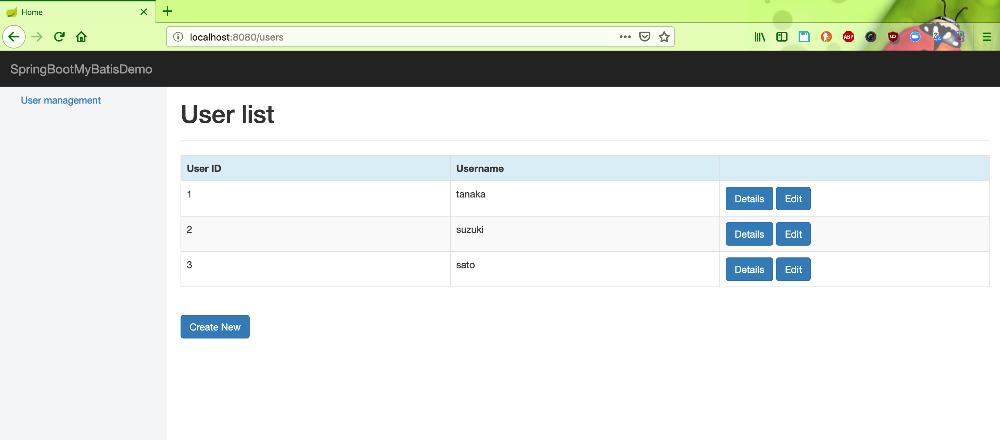
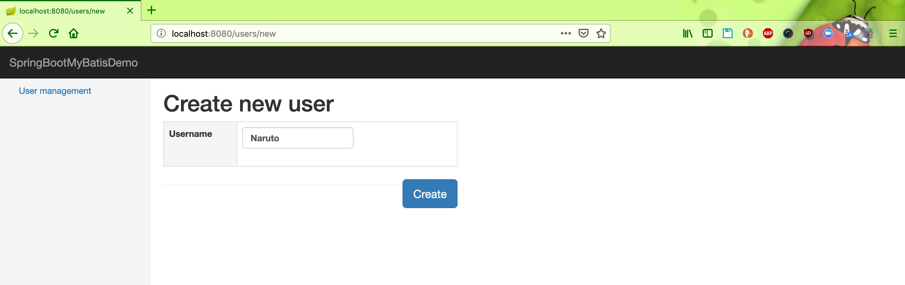
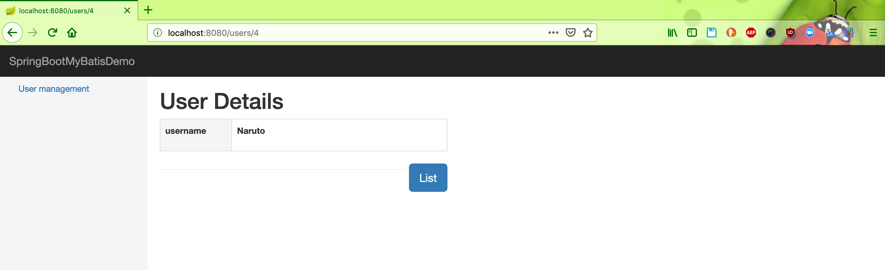
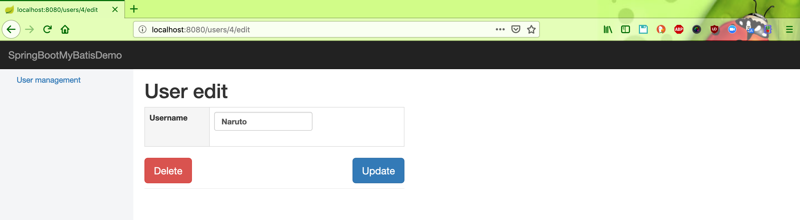

# springboot-mybatis-demo

## Things to do:
* Clone this repository: `git clone https://github.com/hendisantika/springboot-mybatis-demo.git`
* Go to the folder: `cd springboot-mybatis-demo`
* Run the application: `mvn clean spring-boot:run`
* Open your favorite browser: http://localhost:8080/users

## Screen shot

Home Page

Add New User

Details User

Edit User

